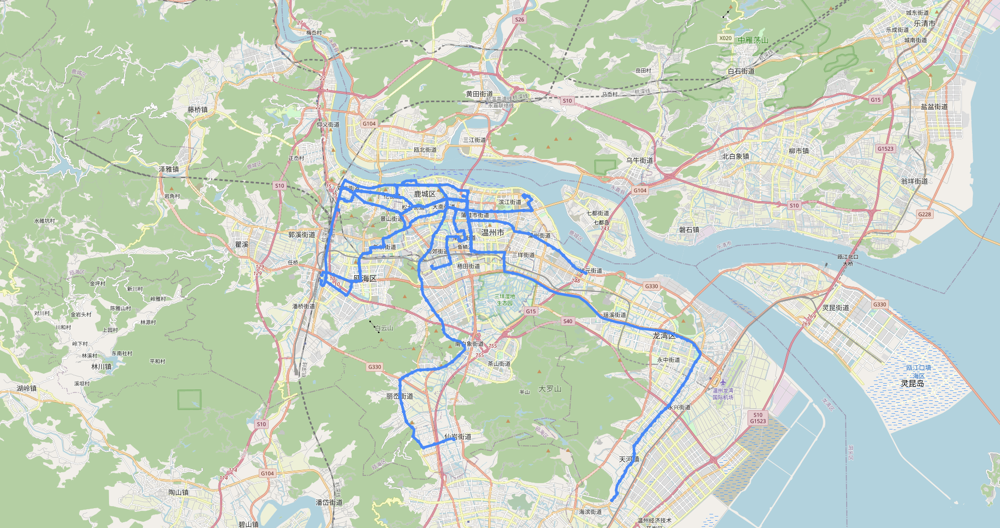

# 温州公交 → GeoJSON + OSM 预览

批量从 **高德地图 WebService** 获取温州公交线路，转换 **GCJ-02 → WGS-84** 坐标系，导出 **每条线路的 GeoJSON** 文件，并自动生成 **OSM 地图预览**。

* 对每个关键词（线路名）选择 **`id` 数字最小** 的候选结果（不筛选公司名）。
* 如果输出文件已存在（且 `--overwrite` 未开启），会跳过请求，直接使用现有文件。
* 始终会生成 **OSM 地图预览 HTML**，包含彩色线路、偏移显示和站点信息。

---

## 1）环境要求

* Python 3.8+
* 高德 **WebService** Key（环境变量 `AMAP_WS_KEY`）
* 依赖：

  * `folium`（用于生成预览，可选但建议安装）
  * `shapely`（用于线路偏移显示）
  * `pyproj`（用于坐标投影）

```bash
pip install folium shapely pyproj
export AMAP_WS_KEY=你的_webservice_key
```

> 必须是 **WebService** 类型的 Key（不是 JS Key）。如果你同时使用 JS API，需要分别申请 Key。

---

## 2）文件说明

* `wenzhou_bus_batch_colored_tweaked.py` — 主脚本（增强版，包含彩色显示和隐私保护）
* `wenzhou_bus_batch.py` — 原始脚本
* （可选）输入文件，例如 `routes.txt`：每行一个线路名（例如 `B1路`, `24路`）
* 输出目录（默认 `out_wz/`）：

  * `route_<线路名>.geojson` — 线路折线（LineString, WGS-84）
  * `stop_<线路名>.geojson` — 站点（Points, WGS-84）
  * `preview.html`（或你自定义的 `--preview_name`）

---

## 3）快速开始

直接运行（城市默认=温州，关键词用内置列表，输出目录=out\_wz，**自动生成预览**）：

```bash
export AMAP_WS_KEY=你的_webservice_key
python wenzhou_bus_batch_colored_tweaked.py
```

运行流程：

1. 用 `/v3/bus/linename` 查询线路 → 选取最小 `id` → 用 `/v3/bus/lineid` 获取详情
2. GCJ-02 转 WGS-84
3. 写出 `route_*.geojson` 和 `stop_*.geojson`
4. 生成 `out_wz/preview.html`（包含彩色线路、偏移显示和隐私保护的站点位置）

用浏览器打开 `out_wz/preview.html` 查看地图。

---

## 4）自定义线路文件（`--file`）和预览文件名

假设有一个文件 **`high_frequency_HSR_Station.txt`**，每行一个线路名。运行示例：

```bash
python wenzhou_bus_batch_colored_tweaked.py \
  --file high_frequency_HSR_Station.txt \
  --preview_name high_frequency_HSR_Station_preview.html
```

输出：

* `out_wz/route_<线路名>.geojson` / `out_wz/stop_<线路名>.geojson`
* `out_wz/high_frequency_HSR_Station_preview.html`

> 如果两份 GeoJSON 文件已存在，且未加 `--overwrite`，脚本会跳过该线路。

---

## 5）增强功能

### 可视化增强
* **彩色线路**：每条线路使用不同颜色
* **偏移显示**：重叠线路自动偏移，避免遮挡
* **站点信息**：点击站点显示站点名称和经过的线路
* **线路标签**：悬停或点击线路显示线路名称

### 隐私保护与合规性
* **坐标抖动**：预览地图中的站点和线路坐标随机偏移±5米，保护隐私并符合高德地图API使用条款
* **数据完整性**：原始GeoJSON文件保持精确坐标，仅预览时应用抖动
* **合规使用**：遵守高德地图API服务条款和中国政府相关法规
* **非商业用途**：仅供研究、教育和非商业用途使用

### 数据来源声明
* **数据来源**：高德地图（AMap/高德地图）WebService API
* **地图瓦片**：OpenStreetMap（遵循OSM瓦片使用规范）
* **使用限制**：不得用于商业用途，不得声称数据为官方或精确数据
* **免责声明**：站点位置为近似位置，仅用于可视化展示，不适用于导航或官方用途

### 使用示例

**带隐私保护的增强版**（推荐用于公开分享，符合API条款）：
```bash
python3 wenzhou_bus_batch_colored_tweaked.py \
  --file High_Freq_Routes.txt \
  --preview_name high_frequency_Routes_jittered.html
```

**标准彩色版**（用于内部使用）：
```bash
python3 wenzhou_bus_batch_colored.py \
  --file High_Freq_Routes.txt \
  --preview_name high_frequency_Routes_preview.html
```

> 两个版本都提供彩色线路和偏移显示，但 `_tweaked` 版本增加了坐标抖动以符合高德地图API使用条款和中国政府法规要求。

---

## 6）示例效果

运行脚本生成的高频线路示例（`demo_high_frequency.png`）：



---

## 7）命令行参数（及默认值）

| 参数               | 默认值            | 说明                                              |
| ---------------- | -------------- | ----------------------------------------------- |
| `--city`         | `温州`           | 城市名或行政区代码                                       |
| `--keywords`     | *(无)*          | 逗号分隔的线路名，如 `B1路,24路`（如果 `--file` 也没给，则使用脚本内置列表） |
| `--file`         | *(无)*          | 每行一个线路名的文本文件                                    |
| `--outdir`       | `out_wz`       | 输出目录                                            |
| `--overwrite`    | `False`        | 即使文件已存在也强制重新获取                                  |
| `--preview_name` | `preview.html` | OSM 预览 HTML 文件名                                 |

**行为默认**：

* 城市默认 **温州**
* 不覆盖已存在文件
* 自动生成预览

---

## 8）在 iPhone 上预览（同一 Wi-Fi）

1. 在包含 `out_wz/` 的目录启动本地服务器：

   ```bash
   python -m http.server 8000
   ```
2. 查找电脑的局域网 IP（macOS：系统设置 → 网络 或 `ifconfig` → `en0` → `inet`）。
3. 在 iPhone Safari/Chrome 打开：

   ```
   http://<电脑IP>:8000/out_wz/preview.html
   ```

   （或你自定义的 `--preview_name`）

---

## 9）线路选择规则

* 对每个关键词（如 `24路`），调用 `linename` API → **选取 `id` 数字最小** 的线路。
* 用该 `id` 调用 `lineid` API 获取路线和站点信息。
* 如需保留双向线路，可以改为选取两个最小不同 `id`。

---

## 10）坐标系与地图对齐

* 高德返回的是 **GCJ-02** 坐标系；脚本会转换为 **WGS-84**（适配 OSM）。
* 脚本预览中有一个 `LON_SHIFT`（默认 `-0.00075`）用于微调地图对齐。如果你的线路在 OSM 上偏移，可以改为：

  ```python
  LON_SHIFT = 0.0
  ```

  或调整到合适值。

---

## 11）跳过与覆盖规则

* 如果 `route_<线路>.geojson` 和 `stop_<线路>.geojson` 都已存在，脚本会：

  * 读取它们并加入预览地图
  * 跳过 API 请求（除非加 `--overwrite`）

---

## 12）常见问题

* **`AMAP_WS_KEY is not set`**
  请先 `export AMAP_WS_KEY=你的_webservice_key`。

* **HTTP/URL 错误**（超时、`HTTPError`、`URLError`）
  可能是网络问题、防火墙或高德 API 限制。可重试或换网络。

* **`linename failed: info=...`** 或 **`lineid failed: info=...`**
  多半是 Key 配额或参数有误。检查城市名（`温州`）和关键词拼写（`B1路` 而不是 `B1`）。

* **预览无内容**
  确认预览文件名和路径正确，用普通浏览器打开 HTML。

---

## 13）内置默认线路

若不传 `--keywords` 和 `--file`，脚本会用内置的 B 线及部分主干线路列表。
你可以用自己的列表覆盖。

---

## 14）可扩展功能（可选加）

* `--both-directions`：保留双向线路
* `--company-prefix`：按公司名前缀筛选（如 `温州交运集团*`）
* 按高频数据设置颜色/粗细（类似地铁线样式）

---

## 15）许可与数据来源

* 高德数据遵守其 API 使用条款（你使用自己的 Key）
* 地图瓦片来自 OpenStreetMap（`folium` 默认），大规模使用请遵守 OSM 瓦片使用规范

